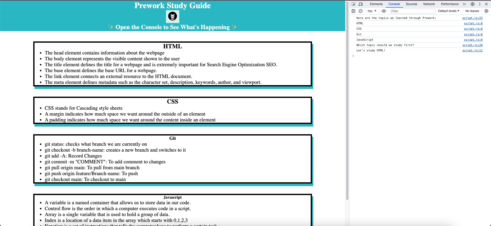

# Prework Study Guide Webpage
## Description

This Prework Study Guide is very career orientated course. It helps many new bootcamp students to get to know the basics of **HTML,CSS,Git and Javascript**. It is very fun and interesting at the same time. It will help you get the basics of the front end and as well as the backend language.
## Installation
N/A
## Usage
To use this Prework Study Guide, you can review different notes on **HTML,CSS,Git,Javascript** section. For suggestions on what to study first, open the Chrome DevTools by pressing *Command+Option+I (macOS)* or *Control+Shift+I (Windows)*. A console panel should open either below or to the side of the webpage in the browser. There you will see a list of topics we learned from the prework along with a suggestion on which topic to study first. When you refresh the page it randomly picks the course name.

## Credits
N/A
## License
MIT License

Copyright (c) 2024 Juju Nakarmi
